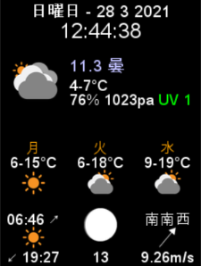

# WeatherPiDisplay S

Weather Station for Raspberry Pi using a small 240x320 pixel LCD. The code is forked from [WeatherPi_TFT](https://github.com/LoveBootCaptain/WeatherPi_TFT) and [WeatherPi](https://github.com/miyaichi/WeatherPi). 
The purpose of this distribution is to provide an adapted layout and configuration for a small screen size such as 2.4" ILI9341 240x320 SPI TFT LCD Display.

I use this on my home office desk for date, time and weather information.
 

---


## Features

- Date
- Time 
- Current weather including temperature, max and mix temperature, humidity, pressure and UV index
- Both current temperature and UV Index changes colour depending on the level
- i18n (internationalisation) support


## Installation

### Install and update tools

```bash
sudo apt-get update -y && sudo apt-get upgrade -y
sudo apt-get install rng-tools gettext -y
sudo apt-get install python3-pygame python3-pillow -y
```

### Install WeatherPi

```bash
git clone https://github.com/SWhardfish/WeatherPiDisplay_MINI.git
cd WeatherPi
```

### Copy config file and customise it

Replace the XXXXXXX for the OpenWeathermap appid and optionally the Google Maps API key. Also update the address and long/lat for your location.

```bash
cp config_example240x320.json config.json
```

#### config.json

| Name                    |          | Default                                  | Description                                                                                                        |
| ----------------------- | -------- | ---------------------------------------- | ------------------------------------------------------------------------------------------------------------------ |
| openweather_appid       | required |                                          | [OpenWeather API Key](https://openweathermap.org/api)                                                          |
| google_api_key          | optional |                                          | [Google Geocoding API key](https://developers.google.com/maps/documentation/geocoding/start)                       |
| address                 | optional |                                          | The address of a location. <br> latitude and longitude can be omitted if google_api_key and address are specified. |
| latitude <br> longitude | required |                                          | The latitude and longitude of a location (in decimal degrees). Positive is east, negative is west.                 |
| locale                  | required | en_GB.UTF-8                              | Locale. Specify the display language of time and weather information.                                              |
| units                   | required | metric                                   | Unit of weather 　 information. (imperial: Fahrenheit, metric: Celsius)                                            |
| SDL_FBDEV               | required | /dev/fb1                                 | Frame buffer device to use in the linux fbcon driver. fb1 for SPI or fb0 for HDMI                                  |
| display                 | required | 240x320                                         | Display size. [Width=240, Height=320]                                                                                      |
| fonts.name              | required | ARIALUNI                                 | Font name.                                                                                                         |
| fonts.size              | required | {xlarge": 40, "mlarge": 35, "large": 30, "medium": 22, "smallmedium": 18, "small": 16, "xsmall": 12} | Font size list. (Style name and point)                                                                             |

- for language-support, units, latitude and longitude please refer to -> [OpenWeather API Docs](https://openweathermap.org/api/one-call-api)

### Setting up the services

```bash
cd
cd WeatherPi
sudo cp WeatherPi_Service.sh /etc/init.d/WeatherPi
sudo chmod +x /etc/init.d/WeatherPi
sudo chmod +x WeatherPi.py
sudo systemctl enable WeatherPi
```

### Run python with root privileges

- this is useful if you like to run your python scripts on boot and with sudo support in python

```bash
sudo chown -v root:root /usr/bin/python3
sudo chmod -v u+s /usr/bin/python3
```

### Setting up python3 as default interpreter

- this should start your wanted python version just by typing `python` in the terminal
- helps if you have projects in python2 and python3 and don't want to hassle with the python version in your service scripts

```bash
update-alternatives --install /usr/bin/python python /usr/bin/python2.7 1
update-alternatives --install /usr/bin/python python /usr/bin/python3.5 2
```


### Test

```bash
./WeatherPi.py [--debug]
```

## Customize weather icons

Below is the list of default OpenWeatheMap icons where as this implementation is using a set of customised icons.

By default, the OpenWeather icons are resized to the display, but you can change to any icon you like.
To change the icons, place the following 18 icons in the icons folder.  


- 01d.png, 01n.png, 02d.png, 02n.png, 03d.png, 03n.png, 04d.png, 04n.png, 09d.png, 09n.png, 10d.png, 10n.png, 11d.png, 11n.png, 13d.png, 13n.png, 50d.png, 50n.png,


| Day icon name | Default                                                             | Night icon name | Default                                                             | Description      |
| ------------- | ------------------------------------------------------------------- | --------------- | ------------------------------------------------------------------- | ---------------- |
| 01d.png       |  | 01n.png         |  | clear sky        |
| 02d.png       |  | 02n.png         |  | few clouds       |
| 03d.png       |  | 03n.png         |  | scattered clouds |
| 04d.png       |  | 04n.png         |  | broken clouds    |
| 09d.png       |  | 09n.png         |  | shower rain      |
| 10d.png       |  | 10n.png         |  | rain             |
| 11d.png       |  | 11n.png         |  | thunderstorm     |
| 13d.png       |  | 13n.png         |  | snow             |
| 50d.png       |  | 50n.png         |  | mist             |

## I18n Internationalisation

You can change the display language of dates and information.  


Swedish (sv_SE.UTF-8)



Japanese (ja_JP.UTF-8)

### Font

This distribution is optmised for and comes with [ARIALUNI.ttf](https://code.google.com/archive/p/ipwn/downloads). If you prefer another font, make sure you install one that works for you and make sure it works with your locale.  

[How to install fonts](https://www.google.com/get/noto/help/install/)

### Built-in Modules

| Name                | Description                         | Options                                 | Size              |
| ------------------- | ----------------------------------- | --------------------------------------- | ----------------- |
| Clock               | Current Time                        | None                                    | 140x60            |
| Weather             | Current Weather                     | icon_size (default 100)                 | 240x100 - 480x100 |
| WeatherForecast     | Weather Forecast                    | forecast_days<br>icon_size (default 50) | 240x80 - 480x80   |
| WeatherHistoryGraph | Weather History                     | history is set to store the last 24h    | 450x480           |
| SunriseSunset       | Sunrise, Sunset time                | icon_size (default 40)                  | 80x80             |
| MoonPhase           | Moon Phase                          | icon_size (default 50)                  | 80x80             |
| Wind                | Wind direction, speed               | icon_size (default 30)                  | 80x80             |


### External Modules

| Name                | Description                             | Options                                 | Size              |
| ------------------- | --------------------------------------- | --------------------------------------- | ----------------- |
| PIR                 | PIR(Passive Infrared Ray）Motion Sens   | Delay (in sec) turning the monitor off   | -                |

               


## Credit

- [WeatherPi_TFT](https://github.com/LoveBootCaptain/WeatherPi_TFT) His python application is what got me started working on this.
- [WeatherPi](https://github.com/miyaichi/WeatherPi) For his excellent coding skills and modularising the original [WeatherPi_TFT](https://github.com/LoveBootCaptain/WeatherPi_TFT) and inspiration.
- [adafruit](https://github.com/adafruit) for [hardware](https://www.adafruit.com/) and [tutorials](https://learn.adafruit.com/)
- [OpenWeather](https://openweathermap.org/) weather api and [documentation](https://openweathermap.org/api/one-call-api)
- [Google Fonts](https://fonts.google.com/)
- [Google NotoFonts](https://www.google.com/get/noto/)
